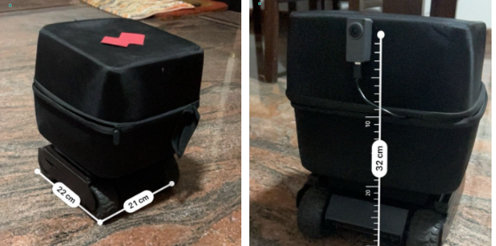

# UGV_CAM: Drive By Wire Platform




This is a codebase to interface with the UGV+Camera platform:
1. UGV01 / UGV02: REST JSON API to control the actuators and get IMU feedback
2. M5Stack-TimerCam: Get video stream

## Components

### Core Interface
```python
from ugv_cam import Agent, Action, ActionEnum, State
agent = Agent(
    ugv_url="192.168.4.1",
    m5cam_url="192.168.4.6",
)

action = Action(
    ActionEnum.CMD_SPEED_CTRL,
    data=dict(
        L=0.5,
        R=0.5,
    )
)
# The action is validated (correct list of parameters and values for the given action type)

state: State = agent.step(action)
state.sensors   # IMU Data, temperature, etc.
state.feedback  # Chassis information feedback
state.image     # Image from the M5 stack
```

### Schema
The codebase uses Pydantic models to ensure type safety and validation:

- `ActionEnum`: Enumeration of all available UGV commands
- `Action`: Command to be sent to UGV with validation
- `State`: Complete UGV state including:
  - `ImuData`: IMU sensor readings (roll, pitch, accelerometer, etc.)
  - `ChassisFeedback`: Basic chassis feedback (speed, voltage)
  - Raw camera image bytes

### Data Logging
The `UGVLogger` automatically logs all sensor data and images:

- Creates timestamped sessions in `~/.ugv_cam/`
- Saves CSV with sensor readings, control inputs
- Stores images with timestamps
- Logged data includes:
  - IMU readings (roll, pitch, accelerometer)
  - Battery voltage
  - Motor speeds
  - Temperature
  - Timestamped images

### PyGame UI
Interactive control and visualization interface:

- Real-time video feed display
- Sensor data visualization
  - IMU orientation
  - Battery voltage graph
  - Temperature
  - Motor speeds
- Multiple control methods:
  - Keyboard (WASD controls)
  - Gamepad support
    - Right stick for movement
    - Analog control for precise speeds
- Status indicators
  - Battery level warnings
  - Connection status
  - Speed indicators

## Installation

TODO: need to push to pipy
```bash
pip install ugv_cam
```

## Usage

### Basic API Usage
See the code example above for basic agent control.

### Running the UI
```bash
# With default connection URLs
python -m ugv_cam

# With custom URLs
python -m ugv_cam --ugv-url http://192.168.4.1 --m5cam-url http://192.168.4.2
```

### Accessing Logged Data
Logs are stored in `~/.ugv_cam/` with timestamps:
```
~/.ugv_cam/
  └── 20240220_153042/
      ├── logs.csv
      └── data/
          ├── 20240220_153042_001.jpg
          ├── 20240220_153042_002.jpg
          └── ...
```